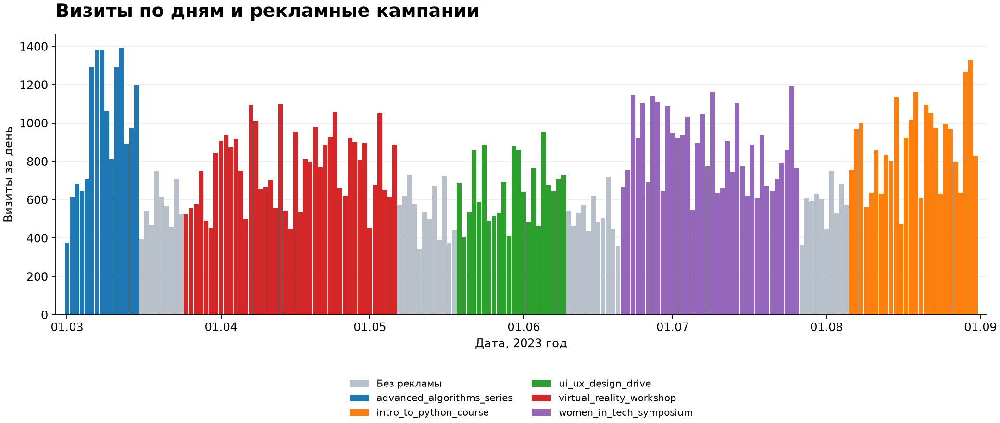
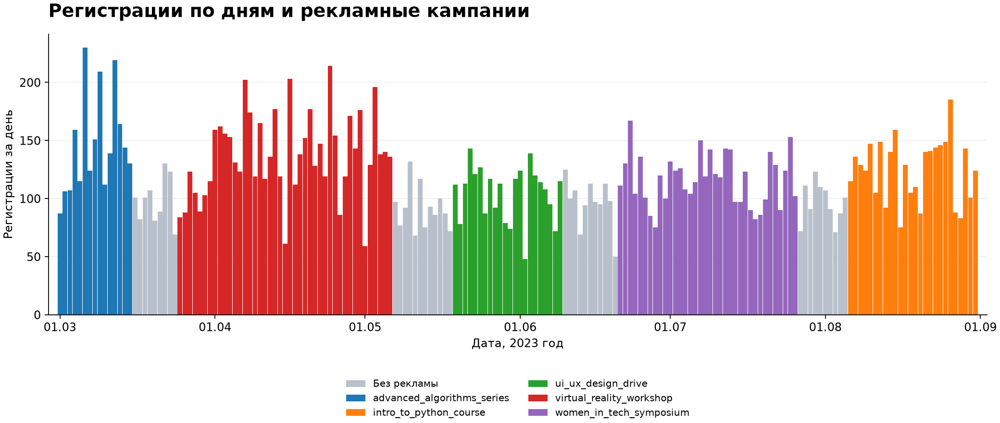
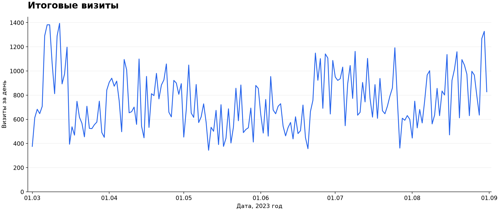
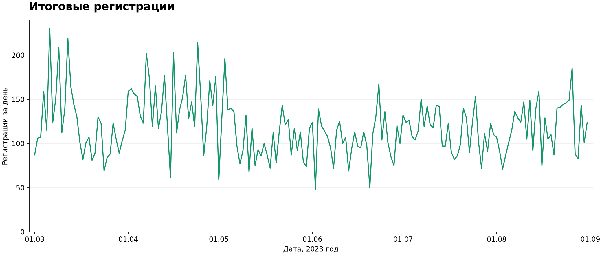
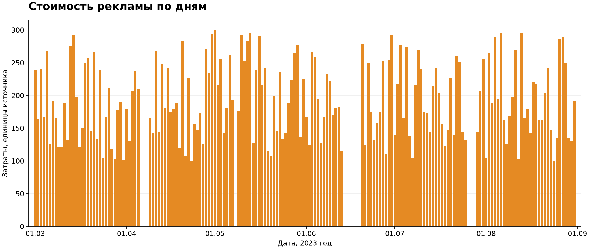
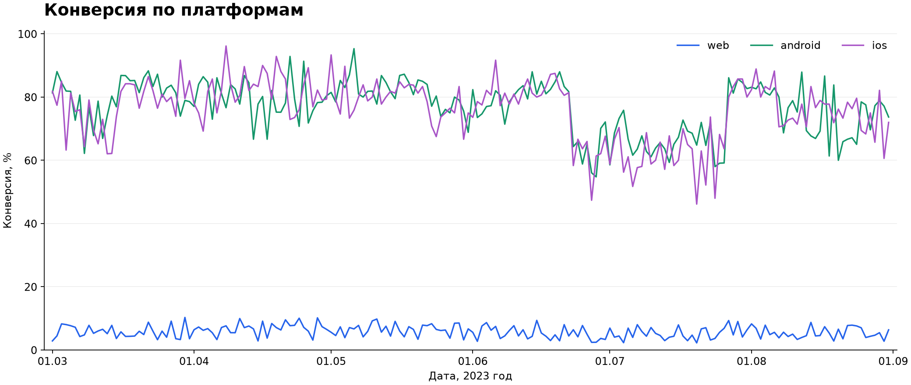

# Анализ визитов, регистраций и рекламы

Период: 1 марта — 31 августа 2023 года. Источники: API с параметрами
`begin=2023-03-01`, `end=2023-09-01` и корневой `ads.csv`.
Используется именно локальный CSV, предусмотренный требованиями сдачи.
Ранее скачанный файл Google Drive содержит другие кампании и в эти выводы не входит.

## Методика

Из 263 459 строк посещений исключены 7 382 строки с `bot` в User-Agent.
После выбора последнего посещения каждого `visit_id` на целевых платформах
осталось 138 703 посетителя. Всего 21 836 регистраций.
Конверсия проекта: регистрации / последние визиты × 100%.
За весь период она равна 15,74%.

Это не когортная конверсия: общего ключа между посетителем и пользователем нет,
а последний визит может произойти после регистрации. Результат зависит от периода,
за который выбирается последний визит. Сравнения не устанавливают причинность.
Средние месячные показатели делятся на число календарных дней месяца.
Семидневные окна включают обе указанные границы.

## 1. Увеличиваются ли визиты и регистрации с запуском рекламы?

В 171 день с рекламой среднее число визитов составило 763,35, регистраций —
119,09. В 13 дней без рекламы — 628,46 и 113,15 соответственно.
Описательная разница: +21,5% визитов и +5,2% регистраций.
Дни без рекламы не являются контрольной группой: отличаются даты, аудитории и
состав платформ. Часть регистраций может быть отложенной.

Сравнение первых 7 дней кампании с предыдущими 7 днями:

| Начало кампании | Кампания | Визиты | Регистрации |
|---|---|---:|---:|
| 09.04 | game_dev_crash_course | −23,3% | −18,8% |
| 09.05 | web_dev_workshop_series | −26,2% | −27,4% |
| 20.06 | tech_career_fair | +48,9% | +17,7% |
| 29.07 | cybersecurity_special | −20,0% | −12,9% |

Для кампании 1 марта нет предыдущей недели в выгрузке. Сравнения других
запусков могут захватывать предыдущую кампанию. Универсального роста после запуска нет.

## 2. Периоды просадки визитов

| Месяц | Визиты в день | Регистрации в день | Расходы в день |
|---|---:|---:|---:|
| Март | 771,52 | 122,13 | 181,35 |
| Апрель | 805,73 | 146,43 | 171,10 |
| Май | 617,81 | 105,39 | 205,19 |
| Июнь | 700,40 | 104,17 | 153,60 |
| Июль | 792,19 | 114,90 | 173,48 |
| Август | 835,23 | 119,45 | 194,10 |

В мае средние дневные визиты снизились на 23,3% к апрелю. Минимальное
семидневное среднее — 505,86 визита за 11–17 мая.
В июне–августе средние месячные визиты восстановились.

## 3. Периоды просадки регистраций

В мае средние дневные регистрации снизились на 28,0% к апрелю.
Минимальное семидневное среднее — 89,29 регистрации за 13–19 мая.
Минимальное среднее за месяц — 104,17 в июне. К августу показатель восстановился
до 119,45, но остался на 18,4% ниже апреля.

## 4. Связь с рекламой, бюджетом и креативами

Майская просадка совпадает с запуском `web_dev_workshop_series` 9 мая.
Средний дневной бюджет при этом вырос на 19,9% к апрелю. Простое объяснение
«снизили бюджет — стало меньше регистраций» для мая не подходит.
В июне бюджет в день снизился на 25,1% к маю, визиты выросли на 13,4%,
а регистрации почти не изменились (−1,2%).

Данные не содержат идентификаторов креатива, показов, кликов, качества аудитории
или атрибуции регистраций. Нельзя утверждать, что причиной стала смена креатива,
или вычислить CPA/ROMI конкретной кампании. Все регистрации дня нельзя автоматически
приписывать рекламе. Расходы за период — 33 119 единиц, валюта не указана.

## 5. Рекламный трафик или неисправность регистрации?

Майское снижение успешных регистраций затронуло все способы. Изменение среднего
числа регистраций в день к апрелю: Apple −28,5%, email −25,4%, Google −30,6%,
Yandex −29,7%. Это не похоже на просадку только одного способа, но общую ошибку
регистрации по этим данным исключить нельзя.

| Месяц | Apple | Email | Google | Yandex |
|---|---:|---:|---:|---:|
| Март | 699 | 1590 | 1208 | 289 |
| Апрель | 841 | 1772 | 1414 | 366 |
| Май | 621 | 1366 | 1014 | 266 |
| Июнь | 600 | 1298 | 974 | 253 |
| Июль | 539 | 1475 | 1272 | 276 |
| Август | 706 | 1495 | 1223 | 279 |

В июле Apple снизился на 13,1% в день к июню, тогда как Google вырос на 26,4%.
Это отдельная гипотеза для проверки логов Apple. Снижение абсолютного количества
успешных регистраций не доказывает сбой: неизвестны число попыток и состав аудитории.

По платформам общая конверсия за период: web 5,78%, android 75,74%, ios 75,41%.
Нужно проверить различия идентификаторов и трафика. В июле конверсия android
составила 67,05%, ios — 64,76%, ниже июня (75,59% и 75,13%).
Это сигнал для проверки мобильной воронки, а не доказанный инцидент.

## Рекомендации

1. Проверить логи ошибок, попытки и успешные завершения регистрации по провайдерам,
   платформам и версиям приложения. Отдельно сравнить июнь и июль для Apple.
2. Проверить источники, аудитории и посадочные страницы майской кампании.
   Сопоставить даты изменений с релизами и рекламными настройками.
3. Добавить сквозной идентификатор и UTM к событиям регистрации. Считать конверсию
   когортно, например регистрация в течение 7 дней после первого визита.
4. Оценить дополнительный эффект рекламы через A/B-тест или контрольную группу,
   заранее задав период, основную метрику и допустимый уровень неопределённости.
5. Настроить мониторинг доли успешных регистраций среди попыток и ошибок по
   провайдерам. Порог выбирать по исторической вариативности, а не по одному дню.

До этих проверок не рекомендовано масштабировать или останавливать кампанию
только по совпадению расходов и дневных регистраций.
